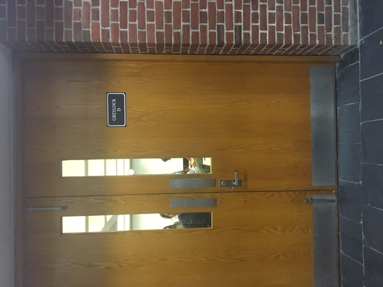

Choosing an example of bad design on Williams campus was easy for me, as a particularly salient example came to mind instantly. I'm in a cappella group here on campus called *Purple Rain*. Last fall, we spent 5 hours every week rehearsing in a room called Greylock D. Each rehearsal, without fail, multiple people would spend too much time at the door, trying to pull it open rather than push it, as its designers intended. After remembering how to open it, the unlucky victim would walk through the now-compliant door with an angry grunt or a few choice words under (or over) the breath. The doors of Greylock D remain a Purple Rain inside joke to this day.  

The problem with this door is clearly its design. Walking up to the door, the user sees a handle that suggests twist-and-pull mechanism. However, they soon find that the door is supposed to be pushed, in contradiction to the usual behavior of doors with this kind of handle. Perhaps the door-maker realized this design miscommunication, and to patch it up, installed the metal push piece above the handle, hoping this would indicate the intended use. Clearly, that didn't work, because the door assailed far too many unsuspecting first-years as they nervously tried to walk into auditions last fall.  

In principle, what makes the design of the Doors of Greylock D so bad is their failure to be self-explanatory. The twist-and-pull door handle sends the wrong message to the user. To fully understand how to use the door, the user must look at the door, notice the push bar and infer that though the handle looks like it should be used in a pulling manner, the presence of the push bar suggests that they should open it inwards instead. This is far too complex a thought process for opening a door. Further, the push bar is not even functional on its own, as a latch must be released to open the door. It is thus not honest in its design.  

I hate these doors and so does everyone else in Purple Rain. That should be evidence enough that these doors are terribly designed. 
