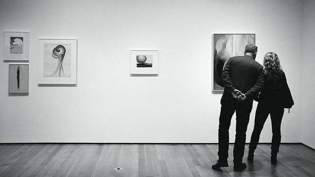

*The following is a proposal centered around a theme of visitor experience at the Williams College Museum of Art.*
 
### Design Problem and Motivation
People enjoy shared experience and the opportunity to express their candid opinions. For example, when we visited WMCA, the members of our class seemed most engaged and excited about the artwork when discussing it together, such as when we sat around the vat of hair gel and shared our ideas about, made jokes, and generally experienced it together. In this instance, we were engaging with the art and sharing our candid, unacademic opinions on it in an intimate setting, all seated around the minty mix. 
Most museumgoers, especially those not visiting with a class or group, don’t have such an opportunity to share casual opinions about art with peers. Walking around the museum on, say, a Tuesday afternoon, you’ll likely find museumgoers walking slowly around each exhibition space. Whether students, faculty or adults, most patrons seem to adopt a sort of museum etiquette in which they pace from piece to piece, perhaps with their hands clasped behind their backs and a pensive expression on their face. They will mutter quiet comments to their companions as they go, often making a remark about an artwork.

*The problem is, this monotonous behavior in museums is not conducive to candid conversation about art with the other museumgoers. Thus, everyones comments remain private to their own party, and the community action of sharing opinions and reactions about art with peers in the moment is left lacking. *

### Analysis
There is immense value in providing the community engagement with art that is so often lacking in the museum experiences of people not visiting WCMA with a class. Social appreciation of art is crucial to its understanding and utility. In an article for Davos 2016, World Economic Forum Crystal Award winner Olaf Eliasson writes,
> “...engaging with a good work of art can connect you to your senses, body, and mind. It can make the world felt. And this felt feeling may spur thinking, engagement, and even action… Engaging with art is not simply a solitary event. The arts and culture represent one of the few areas in our society where people can come together to share an experience even if they see the world in radically different ways. The important thing is not that we agree about the experience that we share, but that we consider it worthwhile sharing an experience at all.” 
>Source: https://www.weforum.org/agenda/2016/01/why-art-has-the-power-to-change-the-world/

Thus we can understand the need for a casual, real-time social aspect of art engagement for WCMA museumgoers. Such an experience allows for exciting sharing of thoughts and ideas. Currently, museum visitors each experience the exhibitions in their own respective bubbles. Merging these bubbles would greatly increase both the emotional engagement of visitors and the impact and reach of the artwork to its viewers. It should be noted that isolated, solitary pondering is also important to the growth of a relationship with and understanding of an artwork. Thus, it may be important to retain this aspect of experience in designing a solution to this problem. 

